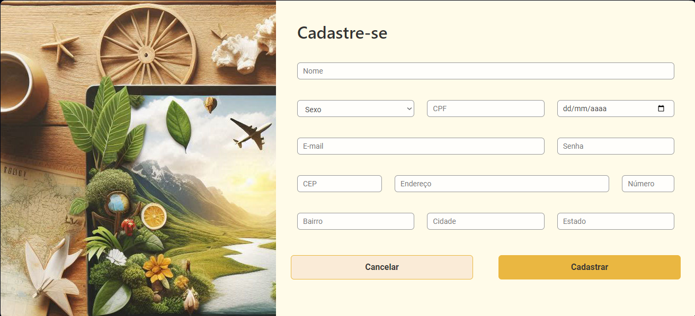
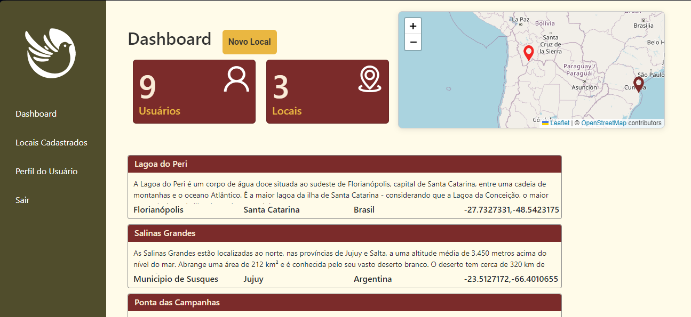

## Viagem 365 - Birdy
### Front-End

O projeto tem como objetivo planejar, registrar e explorar destinos turísticos, naturais e sustentáveis, com experiências positivas, facilidade e segurança.  O aplicativo permitirá aos usuários registrar suas experiências de viagens e colecionar suas histórias.


🛠️ Foi desenvolvido com:

    React + Vite    
    Bootstrap    
    HTML    
    CSS     
    JavaScript     
    dotenv

🗺️ Para requisições geográficas e mapa:

    axios
    nominatim-geocoder
    leaflet

🙋 Para gerar os cadastros de usuários:

    https://www.4devs.com.br/gerador_de_pessoas

🎬 Para rodar o repositório:

    🐑 Clone o repositório
    📦 Instale as dependências:
        npm install

📽️ Para rodar o repositório em ambiente local:

    npm run dev
    npx json-server db.json

🛝 Acesse pelo navegador:
    http://localhost:5173


## Tela Login


## Tela Cadastro




## Tela Dashboard




# 🚀 🚀 Não faça sua viagem sem antes utilizar a Birdy

  A Birdy é uma plataforma que visa promover viagens sustentáveis e experiências positivas para os usuários, fornecendo acesso a informações sobre destinos turísticos, praias, atrações naturais e atividades recreativas. Os usuários podem explorar e descobrir novos destinos, encontrar dicas de viagem sustentável e compartilhar suas experiências. O seu perfil chamou a atenção dos gestores da plataforma, para criar o MVP (Minimum Viable Product) da aplicação Front-End do software, que deverá ser construída utilizando a biblioteca React.
  
## 🏦 Módulo 1 - Projeto Avaliativo

Este repositório se baseia no projeto avaliativo do curso FuturoDev com entrega no dia 14/10/2024 encerrando o terceiro módulo.
Seguindo um roteiro e aplicando as regras de negócio e rotas/telas que devem ser criadas na aplicação com todas as regras de entrega do projeto avaliativo.

**Objetivo: Montagem e execução de uma aplicação Front-End, que deverá ser integrada ao BackEnd**

 A Birdy deseja automatizar algumas ações de atendimento, criando um sistema para armazenamento de informações do usuário(s) e seus destino(s) que poderá servir para gerar um aplicativo que demonstra os pontos de interesses dos usuários para coletar dados, gerar marketing pra empresas de turismo, engajamento em rotas desconhecidas e melhorias de conservação da natureza local...

  *Bora usar as boas praticas de desenvolvimento de software!*

  ## 📉 Diagrama telas

  

## 🤖 Como rodar o repositório:

Primeiros passos:

    1. `git clone https://github.com/FuturoDEV-Trip/M3P-FrontEnd-squad1`
    2. `cd viagem365Frontend`
    3. `npm install`
    4. `npm run dev`

Assim aparecerá a url que renderizará seu projeto no browser:

```
react-trip@0.0.0 dev vite

Re-optimizing dependencies because vite config has changed

VITE v5.3.2 ready in 168 ms
➜ Local: http://localhost:5173/ -----> este é a url para acessar o projeto na rede.
➜ Network: use --host 
to expose ➜ press h + enter to show help
```

Rodar json server:
```
npx json-server db.json
```
```
Endpoints:
http://localhost:3000/users 
http://localhost:3000/localidade 
```

## 🌊 GitFlow:

Iniciei na main mesmo e organizei as pastas, deletei arquivos e iniciei limpo.

developFront: 

*feature/contextLogin - create useContext(context>AuthContext.jsx), protectedRoute e adicionou ao Routes.jsx
*feature/pageLogin - useLogin
*feature/pageCadastroUsuario


## 📂 PARA ACESSAR A DOCUMENTAÇÃO ACESSE O LINK:

Caso tenha alguma dúvida!!

[React Router Dom](https://reactrouter.com/en/main/start/tutorial)

[React Hook Form](https://react-hook-form.com/get-started)

[json-server](https://www.npmjs.com/package/json-server)

[React Leaflet](https://react-leaflet.js.org/)

  
## 🔪 Validações importantes

- O número de CPF e endereço de email sempre deveram ser únicos, não podendo cadastrar mais de uma pessoa a mesma informação.

- Senha tem que ter no mínimo 6 letras, campos obrigatórios no formulário.

- Somente o usuário pode deletar e atualizar seus destinos, não podendo deletar destinos de outros usuários.

- No cadastro de localidades e atualização quando colocar o CEP preencherá automaticamente a cidade e estado, separado por virgula no campo do input de Localidade.

- Na pagina dashboard quando a tela fica maior que 961x779px some as funcionalidades de click do  link editar e botão deletar e para ajustar coloquei width=100vw fixo para nao ter este problema mas quero saber como arrumar

  
## 🛠️ Construído com

- Trello - todos os passos que fiz para criar, roteiro da aplicação, regras de negócios e validações exigidas

<p>
    
</p>

- VsCode - para formar o código em Node.js
- GitHub - utilizando o GitFlow, criado a main, develop e algumas branches para desenvolver cada passo exigido (rotas, Hooks do React, API externa para obter coordenadas geográficas a partir do CEP informado...)
- Vite
- React
- Json-server - para simular uma API fake com cadastro de usuários
- YUP - para validações

  

## 🧑🏻‍🏫 Professor para auxilio

**Bruno Costa** - [GitHub](https://github.com/Bruno-Costa-fig)


## 👀 Melhorias

- Implementar responsividade para adaptação em telas grandes (como monitores) e telas pequenas (como smartphones e tablets).
- Na tela de cadastro, ao colocar o CEP cuidar para não colocar traço pois não funcionará. 
- Fazer um pagina para atualizar dados do usuário
- Fazer um Modal estilizado para perguntar se quer realmente deletar o destino
- Estudar mais CSS kkk

## 🎁 Expressões de gratidão

* O Floripa Mais Tec é uma iniciativa da Prefeitura de Florianópolis, em parceria com SENAI/SC, SEBRAE e ACATE, que visa democratizar o acesso ao ensino tecnológico para todos, oferecendo cursos de Tecnologia gratuitos!  📢;
* Lab365 e todos os monitores;
* Aos melhores colegas de classe de TRIP e NATURE que alguém poderia ter! Este módulo foi mais na raça com ajuda do ChatGPT
* Qualquer dúvida ou sugestão de melhorar o código eu aceito - algumas escrevi acima!!!


## 	📹 Video de apresentação do MiniProjeto 1

No video fiz uma apresentação rápida do projeto com alguns demostrações da plataforma com o objetivo maior de ter uma comunicação mais assertiva, sem  um roteiro pre determinado. 

[Video] - (https://drive.google.com/file/d/1OgXSE1_mt7pw0oXkQGk_N3sNsXzg_H_J/view?usp=drive_link)

