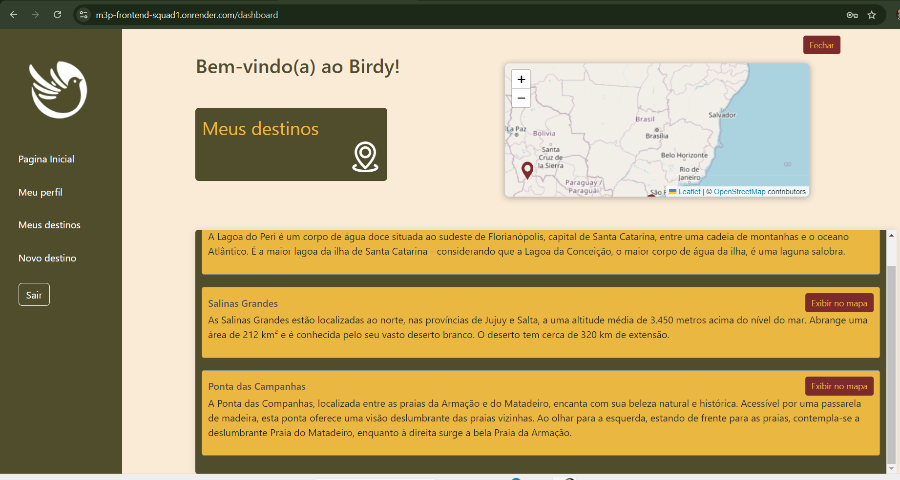
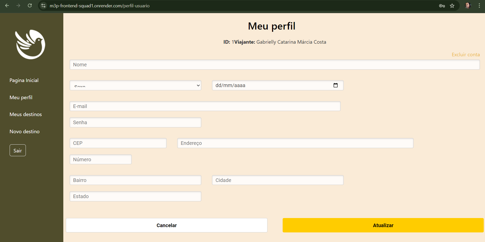
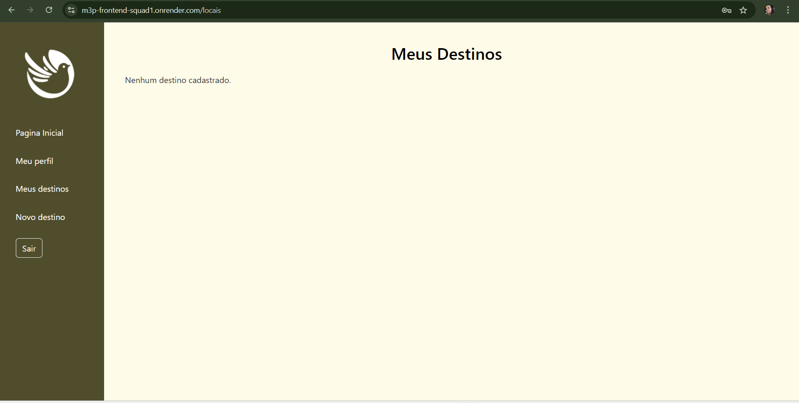
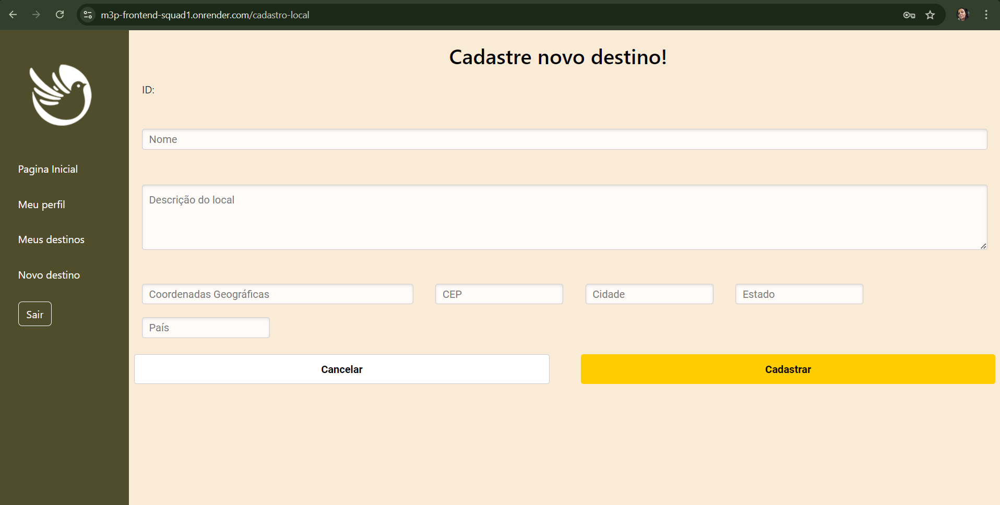

  
  <h1>  Birdy: Viaje leve, seja sustentável,  colecione histórias! </h1>

Birdy é uma plataforma que visa promover viagens sustentáveis e experiências positivas para os usuários, fornecendo acesso a informações sobre destinos turísticos, praias, atrações naturais e atividades recreativas

🛠️ Foi desenvolvido com:

    React + Vite
    Bootstrap
    HTML
    CSS
    JavaScript
    dotenv

🗺️ Para requisições geográficas e mapa:

    axios
    nominatim-geocoder
    leaflet

🙋 Para gerar os cadastros de usuários:

    https://www.4devs.com.br/gerador_de_pessoas

🎬 Para rodar o repositório:

    🐑 Clone o repositório
    📦 Instale as dependências:
        npm install

📽️ Para rodar o repositório em ambiente local:

    npm run dev
    npx json-server db.json

🛝 Acesse pelo navegador:
http://localhost:5173

## Tela Login

## Tela Cadastro

## Tela Home

## Tela Dashboard Privada

## Meu Perfil Privada

## Meus Destinos Privada

## Novo Destino Privada

## 👀 Melhorias

- Implementar Yup: Adicionar validação de formulários utilizando a biblioteca Yup para garantir entradas corretas do usuário.
- Centralizar erros: Criar um sistema centralizado de tratamento de erros para fornecer mensagens de erro mais claras e consistentes ao usuário.
- Refatorar código para React Query: Migrar o gerenciamento de dados assíncronos para o React Query, facilitando o manuseio de cache e estado de carregamento.
- Gerenciamento de estados: Melhorar o gerenciamento de estados utilizando Context API ou outras soluções adequadas para evitar duplicação de lógica.

## Desenvolvedores

Alex Athayde Viana Ribeiro- https://github.com/AlexAthayde

Fernanda Barros Linhares- https://githuFernandaBarrosLinhares

Jorge Luis Herrera Montero- https://github.com/jorge-lherrera

Karina Peres Grigorio -https://github.com/karinaperes
